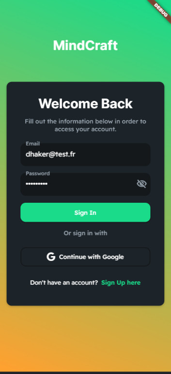
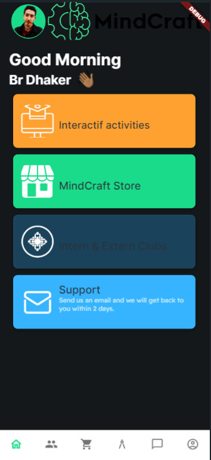
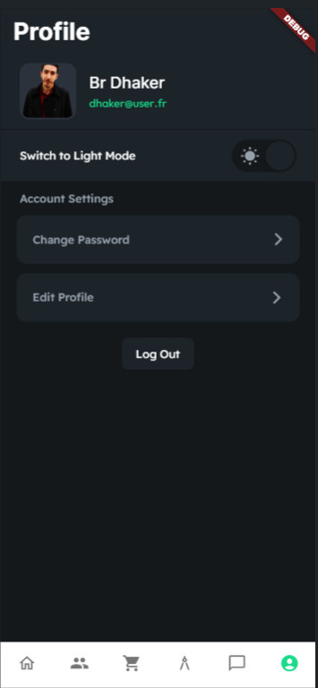
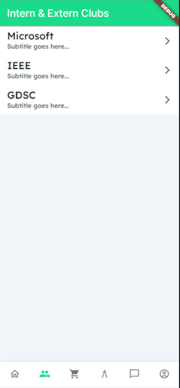
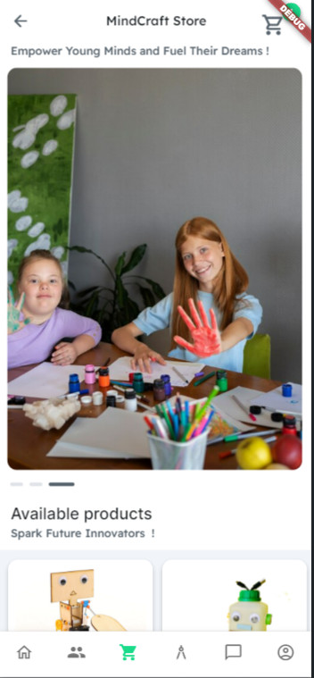
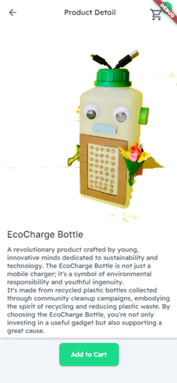

# MindCraft

It's an educational and interactive mobile application as part of a project supported by UNESCO to empower the education system and school communities in Tunisia.

## Getting Started


## Development Setup
Clone the repository and run the following commands:
```
flutter pub get
flutter run
```

## ScreenShot

&nbsp;
&nbsp;
&nbsp;
&nbsp;
&nbsp;
&nbsp;
